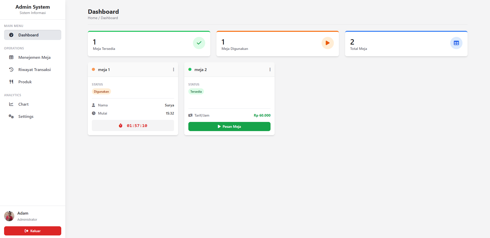

<h1 align="center">System Admin Billiard</h1>

<p align="center">
  <strong>🎱 Solusi Manajemen Billiard untuk Meningkatkan Akurasi Pencatatan Transaksi</strong>
</p>

<p align="center">
  
  
  
  
  
</p>

---

## 📋 Table of Contents
- [🎯 Overview](#-overview)
- [✨ Features](#-features)
- [🛠️ Tech Stack](#-tech-stack)
- [📸 Screenshots](#-screenshots)
- [🚀 Installation](#-installation)
- [📁 Project Structure](#-project-structure)
- [🤝 Contributing](#-contributing)
- [📄 License](#-license)

---

## 🎯 Overview

**System Admin Billiard** adalah sistem manajemen yang dirancang khusus untuk membantu bisnis billiard dalam mengelola operasional secara efisien. Sistem ini fokus pada akurasi pencatatan transaksi untuk menghindari kesalahan keuangan yang sering terjadi dalam sistem manual.

### 🎯 Masalah yang Dipecahkan
❌ **Kesalahan pencatatan keuangan** → ✅ **Sistem otomatis dengan tracking real-time**  
❌ **Data transaksi tidak terstruktur** → ✅ **Database terpusat dengan laporan detail**  
❌ **Kesulitan analisis penjualan** → ✅ **Dashboard analytic yang komprehensif**

---

## ✨ Features

| Feature | Description |
|---------|-------------|
| 🏓 **Manajemen Meja** | Mengelola status meja (tersedia/dipakai/maintenance) |
| 💳 **Tracking Transaksi** | Pencatatan transaksi berbasis meja dengan detail lengkap |
| 🛒 **Pemesanan Produk** | Order makanan/minuman langsung dari meja transaksi |
| 📦 **Manajemen Produk** | CRUD produk dengan kategori dan stok |
| 📊 **Analytic Dashboard** | Visualisasi data penjualan harian, mingguan, bulanan |
| 🖥️ **Desktop Optimized** | Interface yang optimal untuk penggunaan di kasir |

---

## 🛠️ Tech Stack

### Backend
- **Laravel 11** - PHP Framework
- **MySQL** - Database Management
- **Eloquent ORM** - Database Interaction

### Frontend
- **Laravel Blade** - Template Engine
- **Tailwind CSS** - Utility-first CSS Framework
- **Vite** - Build Tool & Development Server
- **Alpine.js** - Lightweight JavaScript Framework

### Development Tools
- **PostCSS** - CSS Processing
- **Axios** - HTTP Client
- **Concurrently** - Run Multiple Commands

---

## 📸 Screenshots
Halaman Dashboard


---

## 🚀 Installation

### 📋 Prerequisites
- PHP 8.2 or higher
- Composer
- Node.js 18+ & NPM
- MySQL 8.0+

### 🔧 Installation Steps

1. **Clone Repository**
   ```bash
   git clone https://github.com/[your-username]/billiard.git
   cd billiard

2. **Install semua dependency PHP, salin file environment, dan buat kunci aplikasi**
   ```bash
   composer install
   copy .env.example .env
   php artisan key:generate

3. **Konfigurasi Database**
   - Buat sebuah database baru di MySQL (misalnya, db_billiard).
   - Buka file .env dan sesuaikan baris DB_DATABASE, DB_USERNAME, dan DB_PASSWORD dengan kredensial database Anda.

4. **Migrasi & Seeding Database**
   Jalankan perintah ini untuk membuat semua tabel dan mengisi data awal (termasuk akun admin default).
   ```bash
   php artisan migrate --seed

5. **Buat Storage Link**
   Perintah ini penting untuk membuat gambar yang diunggah (seperti foto profil) dapat diakses dari web.
   ```bash
   php artisan storage:link

6. **Setup Frontend**
   Install semua dependency JavaScript & CSS, lalu compile aset-aset tersebut.
   ```bash
   npm install
   npm run dev 

7. **Jalankan Server**
   Buka terminal baru dan jalankan server pengembangan Laravel.
   ```bash
   php artisan serve

🌐 Access Application
    - Local URL: http://localhost:8000

🤝 Contributing
Kontribusi sangat terbuka! Silakan fork repository ini dan ajukan pull request untuk perbaikan atau fitur baru. Jangan lupa untuk membuat issue terlebih dahulu jika ada yang ingin didiskusikan.

## 📁 Project Structure
```bash
system-admin-billiard/
├── app/
│   ├── Models/            # Eloquent Models
│   └── Http/
│       ├── Controllers/   # Application Controllers
│       └── Middleware/    # Route Middleware
├── resources/
│   ├── views/             # Blade Templates
│   ├── css/               # Tailwind CSS
│   └── js/                # Alpine.js Components
├── routes/
│   ├── web.php            # Web Routes
│   └── api.php            # API Routes
├── database/
│   ├── migrations/        # Database Migrations
│   └── seeders/           # Database Seeders
└── public/
    ├── build/             # Vite Build Assets
    └── storage/           # File Storage
```

🤝 Contributing
Kontribusi sangat terbuka! Silakan fork repository ini dan ajukan pull request untuk perbaikan atau fitur baru. Jangan lupa untuk membuat issue terlebih dahulu jika ada yang ingin didiskusikan.

